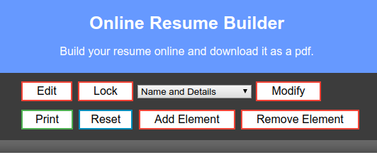

## Resume-Builder App

This is a simple WebApp which helps you to build your resume very quickly, and after that you can save it as pdf file. 

You can visit the website here : https://ajaytekam.github.io/rb/

* To enter details press `Edit` button and when you are done then press `Print` button.   
* The `Selection Box` is used to Modify any of gievn field, means we can Add/Remove fields from various sections. 
* `Reset` Button is used to reset the page.  

**Note** : This is very basic app, which i built for my Web-Tech class Assignment
